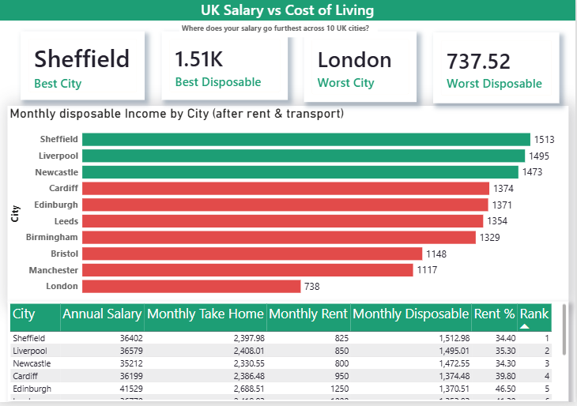
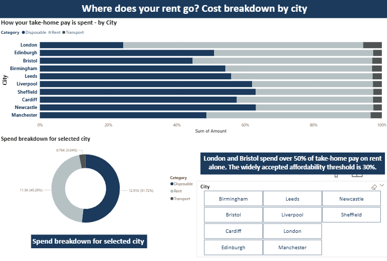
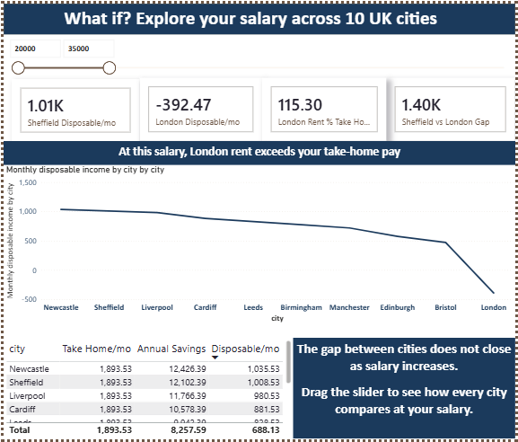

# UK Salary vs Cost of Living — Data Pipeline & Power BI Dashboard

**A £35,000 salary in London leaves you with £738/month disposable income.**  
**The same salary in Sheffield leaves you with £1,513 — more than double.**

I built this to understand the real picture using actual UK government data.

---

## Dashboard





---

## What this does

Pulls live salary data from ONS ASHE and rent data from ONS/VOA —
no static files, no manual downloads. Calculates real take-home pay
after UK income tax and National Insurance (2024/25 rates), then
subtracts median rent and transport costs for 10 UK cities.

**3-page Power BI dashboard:**
- City ranking by monthly disposable income
- Cost breakdown showing rent vs transport vs disposable
- Interactive salary slider from £20,000 to £100,000

---

## Key findings

| Rank | City | Disposable/mo | Rent % of take-home |
|------|------|--------------|---------------------|
| 1 | Sheffield | £1,513 | 34% |
| 2 | Liverpool | £1,495 | 35% |
| 3 | Newcastle | £1,473 | 34% |
| ... | ... | ... | ... |
| 10 | London | £738 | 70% |

The gap does not close as salary increases.

---

## How to run

```bash
git clone https://github.com/AnoudMuhammad/uk-salary-cost-of-living
cd uk-salary-cost-of-living
python -m venv venv && venv\Scripts\activate
pip install -r requirements.txt
python main.py
```

Then open Power BI Desktop and load files from `data/processed/`

---

## Tools
Python · pandas · SQLAlchemy · SQLite · Power BI · DAX · Git

## Data sources
- ONS ASHE Table 7.7a — Annual pay by local authority 2024
- ONS/VOA Private Rental Market Statistics 2024
- HMRC Income tax and NI rates 2024/25
